# Ex-07-Data-Visualization-

## AIM
To Perform Data Visualization on the given dataset and save the data to a file. 

# Explanation
Data visualization is the graphical representation of information and data. By using visual elements like charts, graphs, and maps, data visualization tools provide an accessible way to see and understand trends, outliers, and patterns in data.

# ALGORITHM
### STEP 1
Read the given Data
### STEP 2
Clean the Data Set using Data Cleaning Process
### STEP 3
Apply Feature generation and selection techniques to all the features of the data set
### STEP 4
Apply data visualization techniques to identify the patterns of the data.


# CODE

### Importing necessary packages and reading the csv file.
```python
import pandas as pd
import matplotlib.pyplot as plt
import seaborn as sns
df=pd.read_csv("/content/Superstore.csv",encoding='windows-1252')
df
```
### Checking for null values.
```python
df.isnull().sum()
```
### Dropping unnecessary data.
```python
df.drop(['Row ID','Order ID','Customer ID','Customer Name','Country','Postal Code'],axis=1,inplace=True)
df.drop(['Product ID','Product Name','Order Date','Ship Date','Region','State','City','Segment','Ship Mode','Category','Sub-Category'],axis=1,inplace=True)
print("Updated dataset")
df
```
### Visualizing the outliers.
```python
plt.figure(figsize=(12,10))
plt.title("Data with outliers")
df.boxplot()
plt.show()
```
### Removal of outliers.
```python
cols=['Sales','Quantity','Discount','Profit']
q1=df[cols].quantile(0.75)
q3=df[cols].quantile(0.25)
iqr=q3-q1
low=q1+1.5*iqr
high=q3-1.5*iqr
df2=df[(df[cols]>low)&(df[cols]<high)]
plt.title("Data after removing outlier")
df2.boxplot()
plt.show()
```
### Visualizing the data.
#### Line plots.
```python
sns.lineplot(x="Sub-Category",y="Sales",data=df,marker='o')
plt.title("Sub Categories vs Sales")
plt.xticks(rotation = 90)
plt.show()
```
```python
sns.lineplot(x="Category",y="Profit",data=df,marker='o')
plt.xticks(rotation = 90)
plt.title("Categories vs Profit")
plt.show()
```
```python
sns.lineplot(x="Region",y="Sales",data=df,marker='o')
plt.xticks(rotation = 90)
plt.title("Region area vs Sales")
plt.show()
```
```python
sns.lineplot(x="Category",y="Discount",data=df,marker='o')
plt.title("Categories vs Discount")
plt.show()
```
```python
sns.lineplot(x="Sub-Category",y="Quantity",data=df,marker='o')
plt.xticks(rotation = 90)
plt.title("Sub Categories vs Quantity")
plt.show()
```
#### Count plots. 
```python
plt.figure(figsize=(10,7))
sns.countplot(x ='Segment', data = df,hue = 'Sub-Category')
```
```python
sns.countplot(x ='Region', data = df,hue = 'Segment')
```
```python
sns.countplot(x ='Category', data = df,hue='Discount')
```
```python
sns.countplot(x ='Ship Mode', data = df,hue = 'Quantity')
```
#### Histograms.
```python
sns.histplot(data = df,x = 'Region',hue='Ship Mode')
```
```python
sns.histplot(data = df,x = 'Category',hue='Quantity')
```
```python
sns.histplot(data = df,x = 'Sub-Category',hue='Category')
```
```python
sns.histplot(data = df,x = 'Quantity',hue='Segment')
plt.hist(data = df,x = 'Profit')
plt.show()
```
#### Barplots.
```python
sns.barplot(x="Sub-Category",y="Sales",data=df)
plt.title("Sub Categories vs Sales")
plt.xticks(rotation = 90)
plt.show()
```
```python
sns.barplot(x="Category",y="Profit",data=df)
plt.title("Categories vs Profit")
plt.show()
```
```python
sns.barplot(x="Sub-Category",y="Quantity",data=df)
plt.title("Sub Categories vs Quantity")
plt.xticks(rotation = 90)
plt.show()
```
```python
sns.barplot(x="Category",y="Discount",data=df)
plt.title("Categories vs Discount")
plt.show()
```
```python
plt.figure(figsize=(12,7))
sns.barplot(x="State",y="Sales",data=df)
plt.title("States vs Sales")
plt.xticks(rotation = 90)
plt.show()
```
```python
plt.figure(figsize=(25,8))
sns.barplot(x="State",y="Sales",hue="Region",data=df)
plt.title("State vs Sales based on Region")
plt.xticks(rotation = 90)
plt.show()
```
#### KDE Plots.
```python
sns.kdeplot(x="Profit", data = df,hue='Category')
```
```python
sns.kdeplot(x="Sales", data = df,hue='Region')
```
```python
sns.kdeplot(x="Quantity", data = df,hue='Segment')
```
```python
sns.kdeplot(x="Discount", data = df,hue='Segment')
```
#### Violin Plots.
```python
sns.violinplot(x="Profit",data=df)
```
```python
sns.violinplot(x="Discount",y="Ship Mode",data=df)
```
```python
sns.violinplot(x="Quantity",y="Ship Mode",data=df)
```
# OUPUT
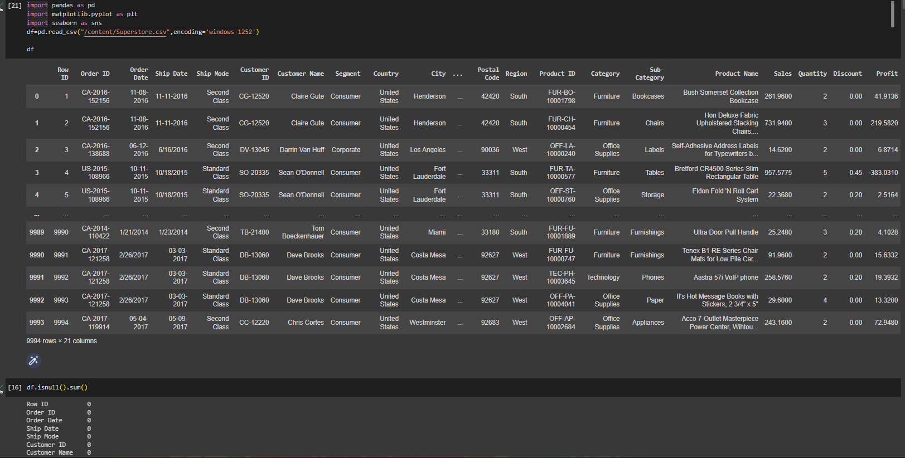
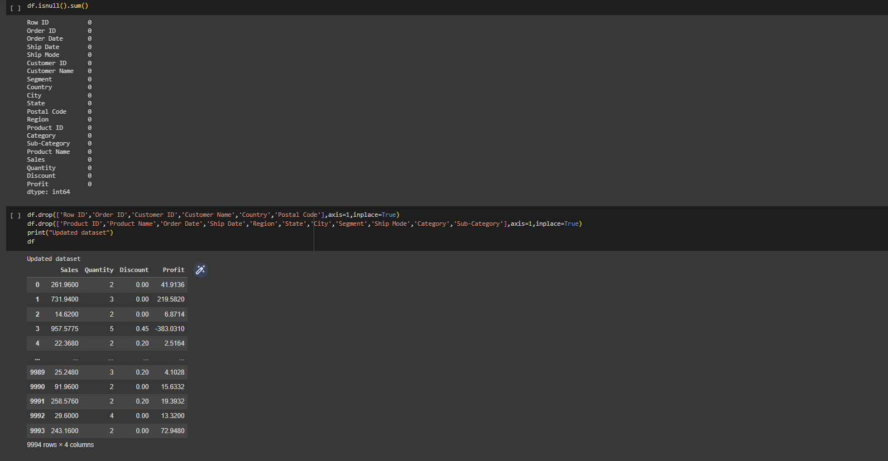
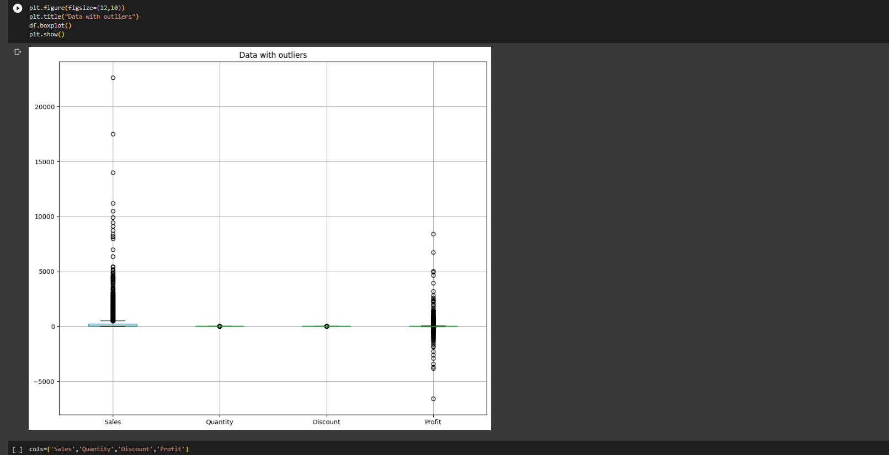
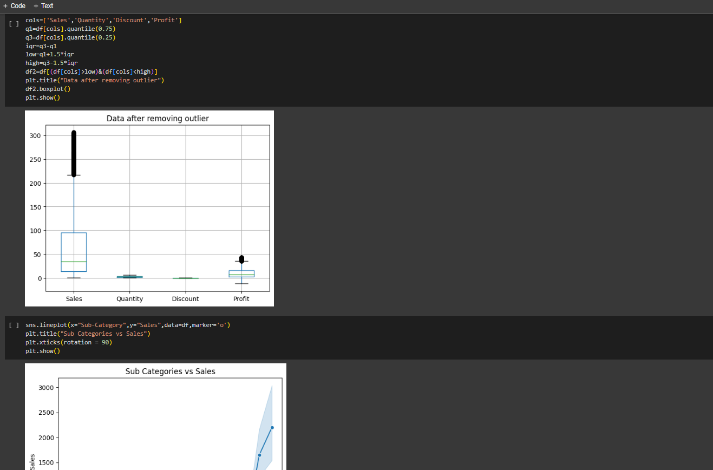
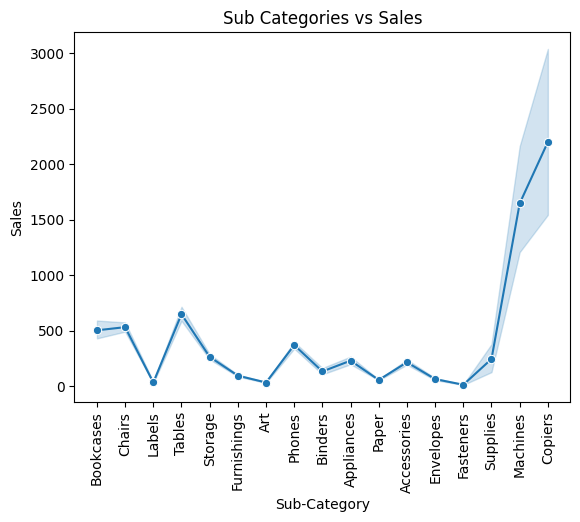
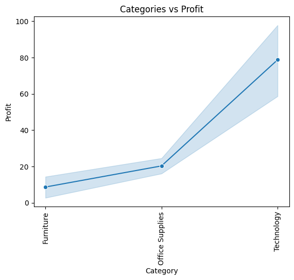
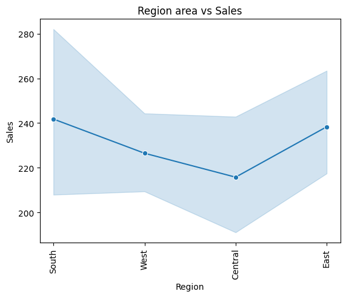
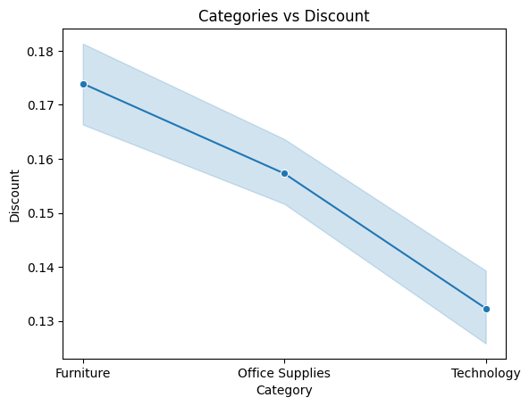
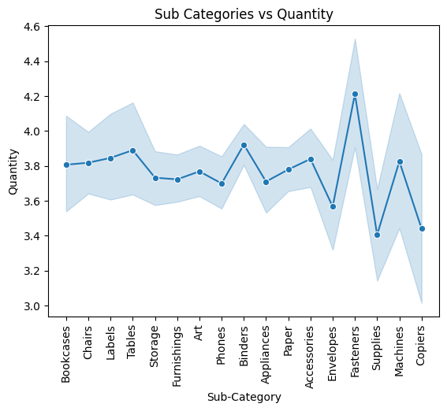
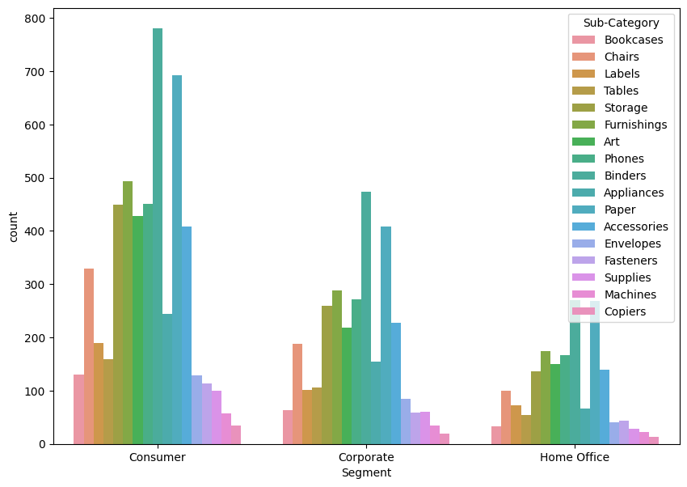
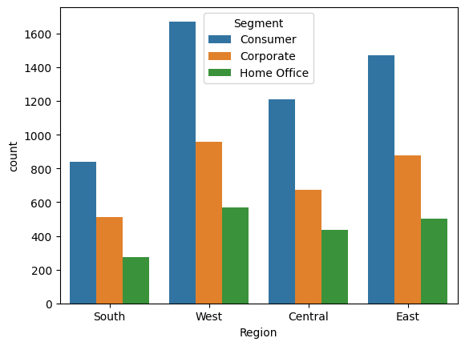
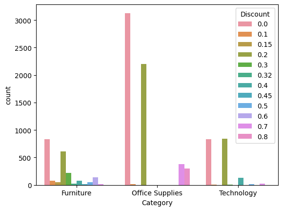
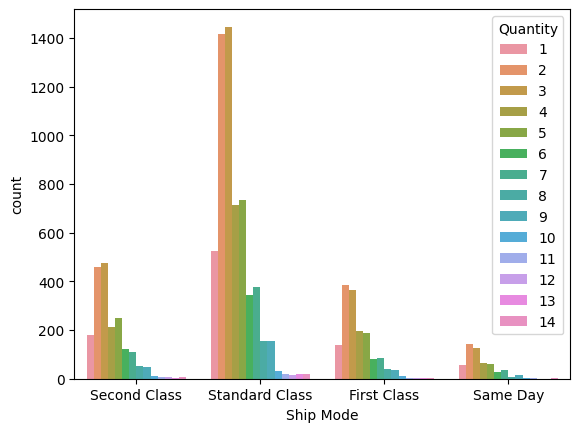
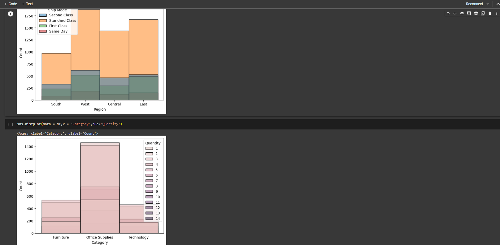
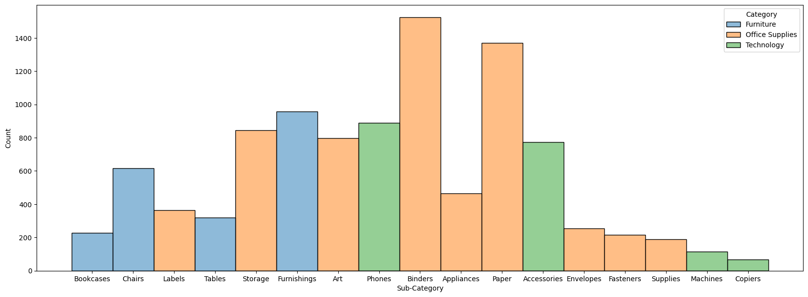
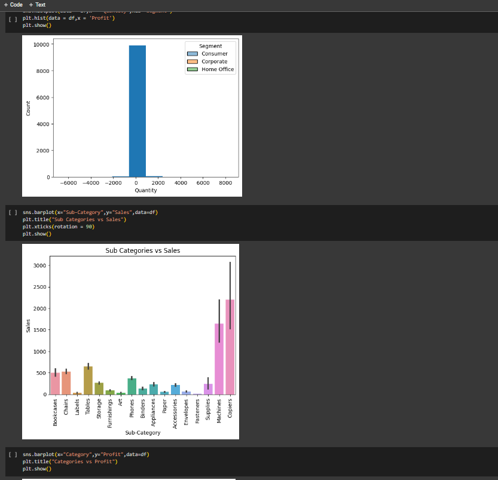
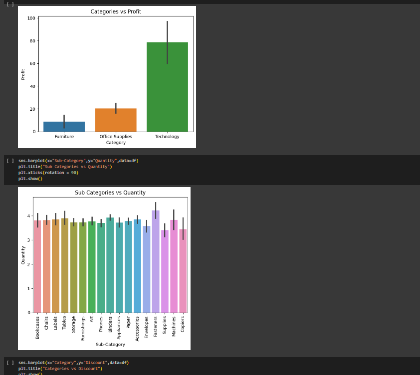
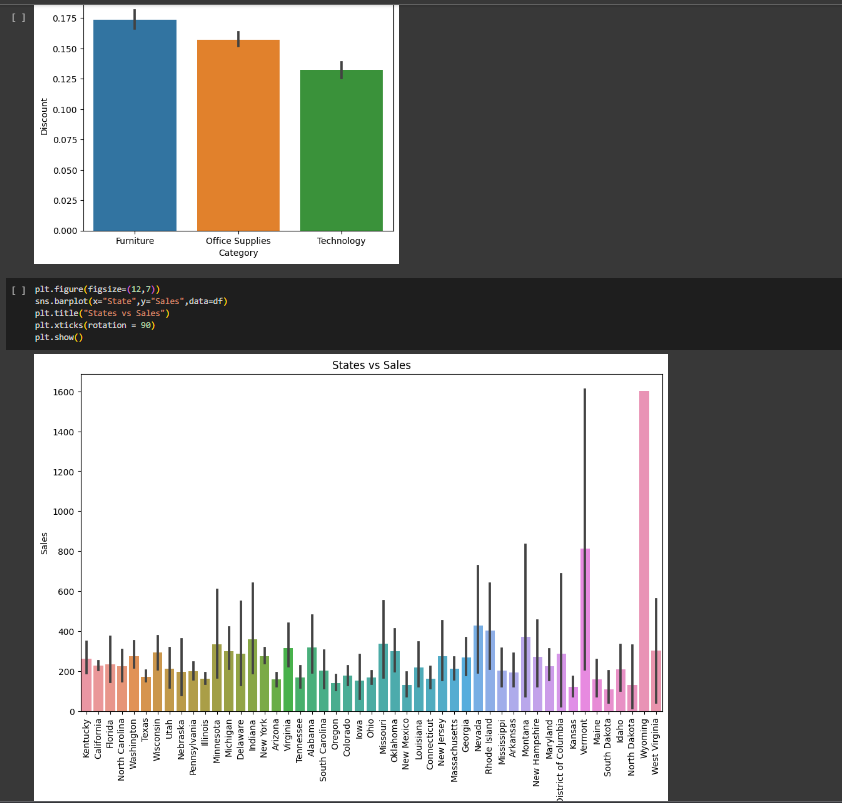
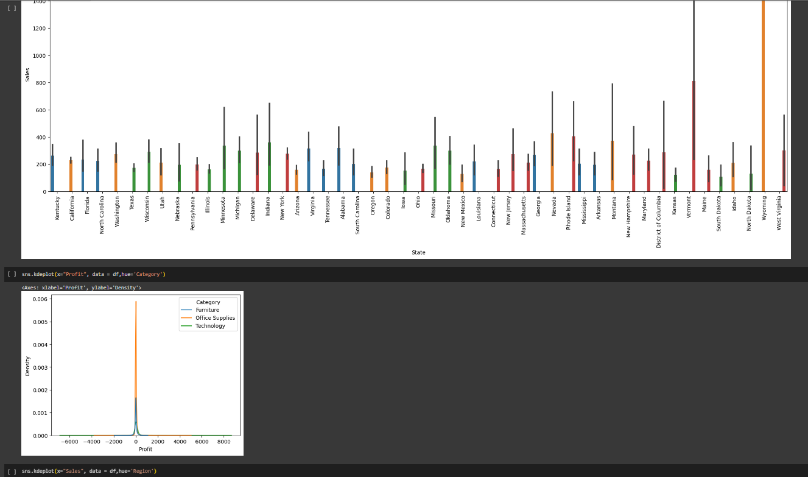
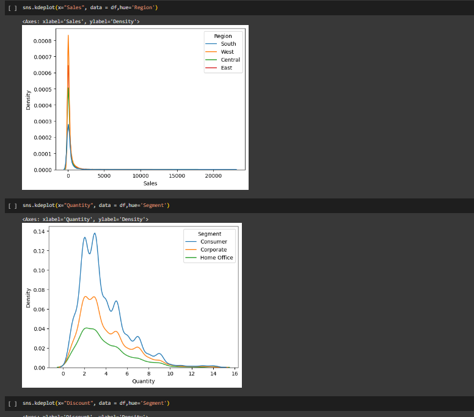
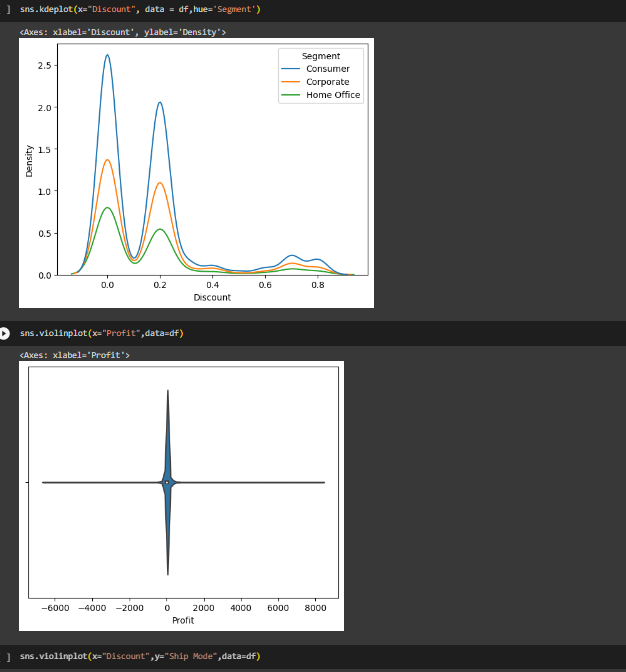
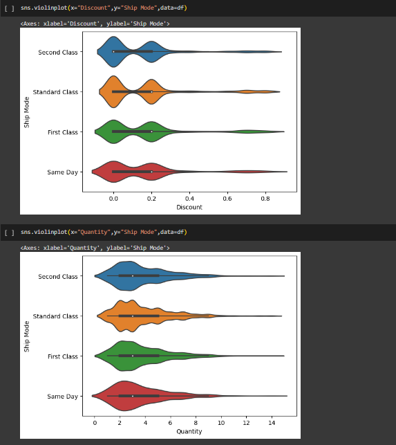

# RESULT

Thus, the given data is visualized succuessfully.